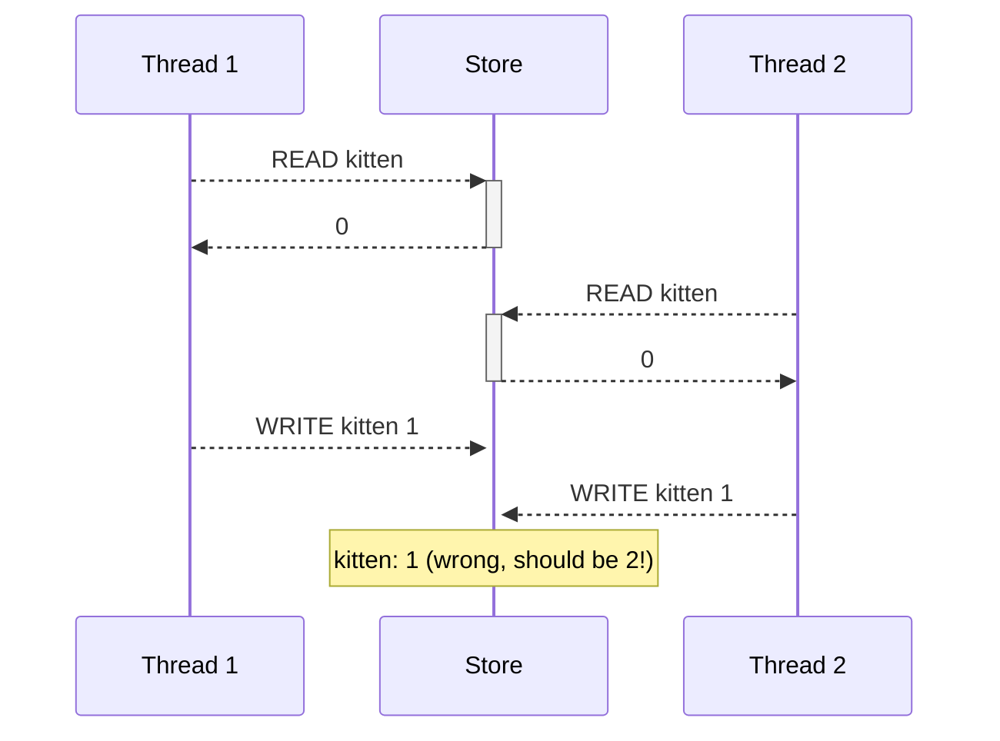
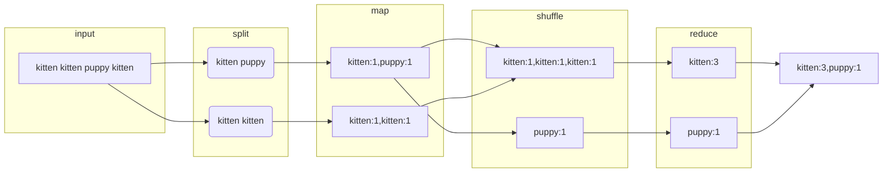
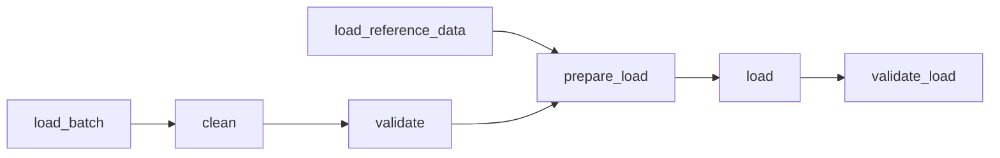

# Diagrams for mermaidjs

Can use https://mermaid-js.github.io/mermaid-live-editor/ to render.

## Race condition sequence diagram

```mermaid
sequenceDiagram
    participant Thread 1
    participant Store
    participant Thread 2
    Thread 1-->>+Store: READ kitten
    Store-->>-Thread 1: 0
    Thread 2-->>+Store: READ kitten
    Store-->>-Thread 2: 0
    Thread 1-->>+Store: WRITE kitten 1
    Thread 2-->>+Store: WRITE kitten 1
    Note over Store: kitten: 1 (wrong, should be 2!)
```

## Map/Reduce Operation

```mermaid
graph LR
    subgraph input
        IN[kitten kitten puppy kitten]
    end
    subgraph split
        IN --> SPLIT1(kitten puppy)
        IN --> SPLIT2(kitten kitten)
    end
    subgraph map
        SPLIT1 --> MAP1
        SPLIT2 --> MAP2
    end
    subgraph shuffle
        MAP1[kitten:1,puppy:1] --> SHUF1
        MAP1 --> SHUF2
        MAP2[kitten:1,kitten:1] --> SHUF1
    end
    subgraph reduce
        SHUF1[kitten:1,kitten:1,kitten:1] --> RED1
        SHUF2[puppy:1] --> RED2
    end
    RED1[kitten:3] --> OUT
    RED2[puppy:1] --> OUT
    OUT[kitten:3,puppy:1]
```

## Pipeline Example

```mermaid
graph LR
    load_batch --> clean
    clean --> validate
    load_reference_data --> prepare_load
    validate --> prepare_load
    prepare_load --> load
    load --> validate_load
```